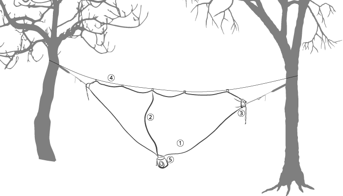
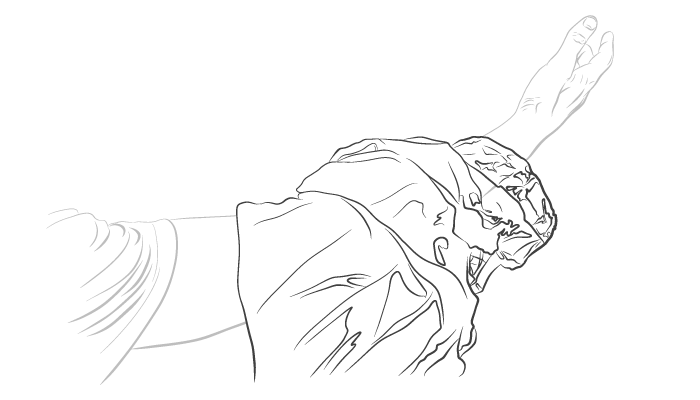

# Hummingbird Hammocks Bug Net Manual

## Table of Contents

- [Hummingbird Hammocks Bug Net Manual](#hummingbird-hammocks-bug-net-manual)
  - [Table of Contents](#table-of-contents)
  - [VIDEO GUIDE](#video-guide)
  - [PARTS](#parts)
  - [CHECK](#check)
  - [PREPARE](#prepare)
  - [PASS OVER HAMMOCK](#pass-over-hammock)
  - [RIDGELINE](#ridgeline)
  - [UN-HANG](#un-hang)
  - [WARNING](#warning)
  - [THANK YOU](#thank-you)
  - [CONTACT](#contact)

## VIDEO GUIDE

https://youtu.be/XR8VlEds2jU

## PARTS

1. Bug Net Body
2. Zipper
3. End Closure
4. Ridge Line
5. Stuff Sack

## CHECK

Check your bug net for any fraying seams, damaged net material, and test the zipper to ensure it is in working order.

Setting up a bug net requires a hammock that is already hung and ready for use.

## PREPARE

Locate the end closure on one end of the bug net. Pass your arm through the entire bug net, from one end closure to another, by scrunching it onto your arm until your hand is exposed on the other side.

## PASS OVER HAMMOCK

Disconnect one end of the hammock and grasp it with the hand that was passed through the bug net. Pull the bug net off your arm and onto the hammock, reconnect the hammock end to its respective tree strap. The bug net should now be completely on the hammock.

Attach one end closure to the hammock by pulling it over the gathered end of the hammock and tightening the seal using the drawstring and cord lock. Repeat for the other side.

## RIDGELINE

Pass the ridgeline cord through all the loops on the top of the bug net and secure either end to each tree using a bowline knot. Tension the ridgeline according to your personal preference and hang height. We recommend securing the ridgeline in a way that allows you to hang center mass within the bug net, Pictured in Image 4. This prevents you from contacting the net anywhere (lest the bugs get you through the net and hammock fabric.  Keep in mind, you can also attach the ridgeline to the tree straps rather than the trees, depending on the height of the straps.

Enter and exit the bug net through the vertical zipper in the center.

## UN-HANG

Once you are ready to exit the hammock, turn sideways so you are sitting in it like a chair again. Lean forward and place your feet on the ground, lean forward, and stand up. Now disassemble your rig by reversing the setup steps. Detach the hammock from the tree straps, throwing the hammock over your shoulder again here will keep it clean and dry, and prevent abrasion from ground debris.

Stuff the bug net back into its stuff sack. This is easily accomplished by holding the bag upside down by the opening and using your fingers to push the bug net back into the bag a little at a time. Attempt to get as much of the bug net into the bottom of the bag as you can, this will ensure there is enough space in the bag to accommodate the whole bug net.

Be sure to clean up your campsite and double-check that any fires have been completely snuffed out.

## WARNING

Do not leave the hammock, bug net, or tree straps in direct sunlight. The UV light will degrade and weaken the nylon material over time.

Avoid stepping on the bug net, letting it drag on the ground, or abrading it in any other way. This will weaken and damage the netting.

Do not use solvents or soaps to clean the bug net, warm or room temperature water will remove most dirt and stains. If soap is needed, only use a very small amount of a very gentle cleaner like Woolite or [Revivex Pro Cleaner](https://hummingbirdhammocks.com/collections/care-and-repair/products/revivex-pro-cleaner).

Dry your bug net in the shade, out of direct sunlight.

Do not pack the bug net up wet, this may result in mildew forming on the fabric.

Be responsible when selecting trees to hang from, they should be at least 8 inches in diameter and healthy enough to support the weight.

**HAPPY HANGING!**

## THANK YOU

Thank you for choosing Hummingbird Hammocks to be your adventure companion! We are honored to be a part of your kit, and appreciate how valuable your pack weight and volume is. We promise to take up as little space and weight as possible!

## CONTACT

If you have any questions, issues or want to provide us with some feedback, please contact us using one of the methods below:

[https://help.hummingbirdhammocks.com/](https://help.hummingbirdhammocks.com/)

[help@hummingbirdhammocks.com](mailto:help@hummingbirdhammocks.com)
